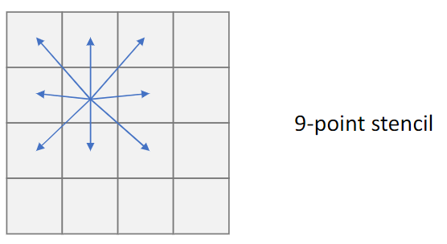
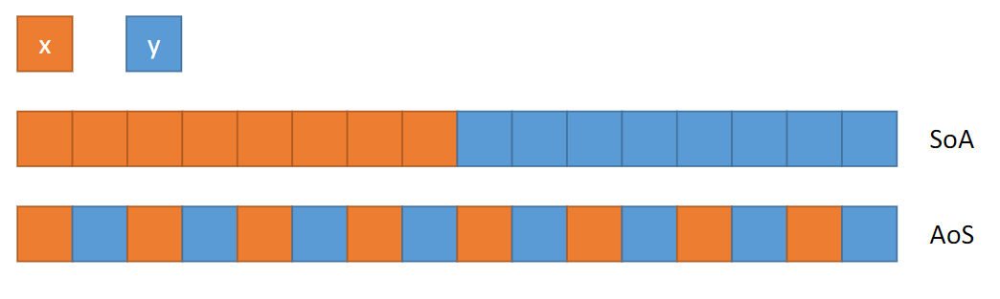
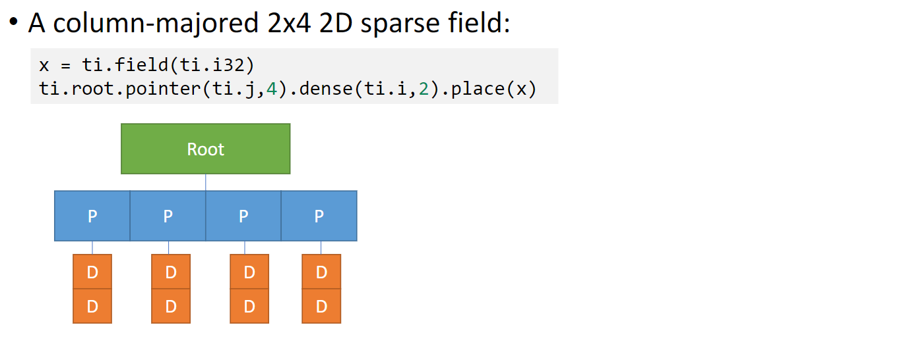
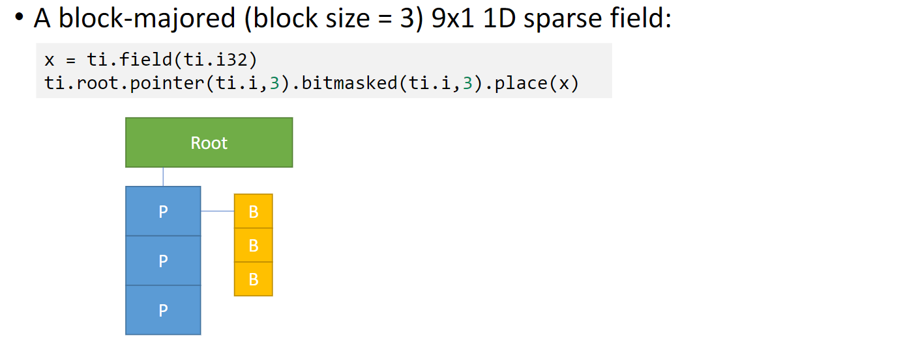
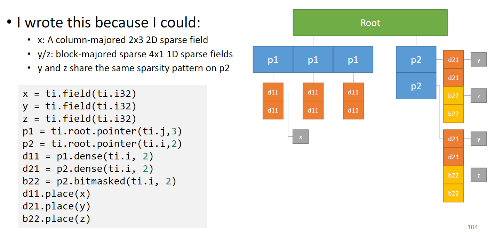

# taichi-techtonic
Architectural Taichi Exploration

- [bilibili](https://space.bilibili.com/1779922645/channel/seriesdetail?sid=337716): 太极图形课
- [docs](https://docs.taichi.graphics)
- [forum](https://forum.taichi.graphics/
)
## Basic

### Scope
- Python Scope
- Taichi Scope
  - decorator: `@ti.kernel` / `@ti.func`
  - taichi kernels can only be called from python scope

#### For-loops in a Taichi Kernel
- for loop at the outmost scope is **automatically parallelized**
- break is NOT supported in the parallel for-loops
``` python
@ti.kernel
def fill():
    for i in range(10): # Parallelized
        x[i] += i
    
        s = 0
        for j in range(5): # Serialized in each parallel thread
            s += j
        
        y[i] = s
    
    for k in range(20): # Parallelized
        z[k] = k
        break # Error!


@ti.kernel
def foo(k: ti.i32):
    for i in range(10): # Parallelized
        if k > 42:
            #...

@ti.kernel
def bar(k: ti.i32):
    if(k > 42):
        for i in range(10): # Serialized
            #...

N = 10
x = ti.Vector.field(2, dtype=ti.i32, shape=(N, N))

@ti.kernel
def zot():
    # loops over ti.field, only lives at outermost scope
    for i, j in x:
        x[i, j] = ti.Vector([i, j])

```

#### Kernel arguments
- at most 8 parameters
- pass from the python scope to taichi scope
- must be type-hinted
- scalar only
- pass by value (not reference)

``` python
@ti.kernel
def good_kernel(vx: ti.f32, vy: ti.f32):
    v = ti.Vector([vx, vy])

```

**Passing arguments using `ti.template()`**
- primary types: `ti.f32`, `ti.i32`, `ti.f64`, ...
- compound types: `ti.Vector()`, `ti.Matrix()`, ..
- fields: `ti.field()`, `ti.Vector.field()`, ...
- taichi class: `@ti.data_oriented`
``` python
@ti.kernel
def foo(x: ti.template()):
    print(x[0], x[1])

# must support by taichi 
a = ti.Vector([42, 3.14])
foo(a)
```
variables pass by reference but modify is not allowed

**more general**, use `ti.grouped()`

``` python
@ti.kernel
def copy(x: ti.template(), y: ti.template()):
    assert x.shape == y.shape
    for I in ti.grouped(y):
        # if y is 0D, then I = None
        # if y is 1D, then i = i
        # if y is 2D, then i = i, j
        # if y is 3D, then i = i, j, k
        # ...

        x[I] = y[I]
```
#### Kernel return value
- may or may not return
- return on single scalar value only
- must be type-hinted

``` python
import taichi as ti
ti.init(arch=ti.cpu)

@ti.kernel
def my_kernel() -> ti.i32: # return int32
    return 233.666

print(my_kernel())
# 233
```
#### `@ti.func`
- can only be called from taichi scope
- can be nested 
- force-inline 强制内联，不支持递归
- do not need to be type-hinted
- pass by value

### Primitive types
- signed integers: `ti.i8`, `ti.i16`, `ti.i32`, `ti.i64`
- unsigned integers: `ti.u8`, `ti.u16`, `ti.u32`, `ti.u64`
- floating points: `ti.f32`, `ti.f64`

default: 
- `ti.i32`
- `ti.f32`


``` python
# modify default types
ti.init(default_fp=ti.f64)
ti.init(default_fp=ti.i64)
```

#### type casts

pick more precise type to store result:
- i32 + f32 = f32
- i32 + i64 = i64

**implicit cast**
``` python
import taichi as ti
ti.init(arch=ti.cpu)


def foo():
    print("this is normal")
    a = 1
    a = 2.7
    print(a)

foo()

    
@ti.kernel
def bar():
    print("this is taichi")
    a = 1
    a = 2.7
    print(a)

bar()
```

**variable = ti.cast(varible, type)**
``` python
import taichi as ti
ti.init(arch=ti.cpu)

@ti.kernel
def zot():
    a = 1.7
    b = ti.cast(a, ti.i32)
    c = ti.cast(b, ti.f32)
    print("b =", b) # b = 1
    print("c =", c) # c = 1.000000

zot()
```

### Compound Types

#### Using `ti.types`
- vector
- matrix
- struct

``` python
import taichi as ti
ti.init(arch=ti.cpu)

vec3f = ti.types.vector(3, ti.f32)
mat2f = ti.types.matrix(2, 2, ti.f32)
ray = ti.types.struct(ro=vec3f, rd=vec3f, l=ti.f32)

@ti.kernel
def foo():
    a = vec3f(0.0) 
    print(a)                # [0.000000, 0.000000, 0.000000]
    d = vec3f(0, 1, 0)
    print(d)                # [0.000000, 1.000000, 0.000000]

    B = mat2f([[1.5, 1.4], [1.3, 1.2]])
    print("B =", B)         # B = [[1.500000, 1.400000], [1.300000, 1.200000]]

    r = ray(ro=a, rd=d, l=1)
    # r = ray(a, d, 1) UnboundLocalError: local variable 'entries' referenced before assignment
    #print(r) Error: Cannot initialize scalar expression
    print("r.ro =", r.ro)   # r.ro = [0.000000, 0.000000, 0.000000]
    print("r.rd =", r.rd)   # r.rd = [0.000000, 1.000000, 0.000000]

foo()
```
#### Using `ti.Vector/Matrix/Struct`

``` python
import taichi as ti
ti.init(arch=ti.cpu)

@ti.kernel
def bar():
    a = ti.Vector([0.0, 0.0, 0.0])
    print(a)                # [0.000000, 0.000000, 0.000000]
    print(a[0])             # 0.000000
    d = ti.Vector([0.0, 1.0, 0.0])
    print(d)                # [0.000000, 1.000000, 0.000000]
    B = ti.Matrix([[1.5, 1.4], [1.3, 1.2]])
    print(B)                # [[1.500000, 1.400000], [1.300000, 1.200000]]
    print(B[1, 1])          # 1.200000

    r = ti.Struct(ro=a, rd=d, l=1)
    print("r.ro =", r.ro)   # r.ro = [0.000000, 0.000000, 0.000000] 
    print("r.rd =", r.rd)   # r.rd = [0.000000, 1.000000, 0.000000]

bar()
```

#### `ti.field`
global N-d array elements
- global: read/writen from python-scope and taichi-scope
- N-d: Scalar: N=0, Vector: N=1, Matrix: N=2, (N=3,4,5...)
- elements: scalar, vector, matrix, struct
- use [i, j, k, ...] indexing
``` python
import taichi as ti
ti.init(arch=ti.cpu)

# 2d pixels
pixels = ti.field(dtype=float, shape=(16, 8))
pixels[1, 2] = 42

# vector field
vf = ti.Vector.field(3, ti.f32, shape=4)
@ti.kernel
def foo():
    v = ti.Vector([1, 2, 3])
    vf[0] = v
    print(vf[1])        # [0.000000, 0.000000, 0.000000]

foo()

# global scalar: must use [None]
# 全局变量
zero_d = ti.field(dtype=float, shape=())
zero_d[None] = 1.5
print(zero_d[None])     # 1.5

zero_d_vec = ti.Vector.field(3, ti.f32, shape=())
zero_d_vec[None] = ti.Vector([1, 2, 3])
print(zero_d_vec[None]) # [1. 2. 3.]
```

### Operators

#### Trigonometric functions
``` python
ti.sin(x)
ti.cos(x)
ti.tan(x)
ti.asin(x)
ti.acos(x)
ti.atan2(x, y)
ti.tanh(x)
```

#### Other arithmetic functions
``` python
ti.sqrt(x)
ti.rsqrt(x)  # A fast version for `1 / ti.sqrt(x)`.
ti.exp(x)
ti.log(x)
ti.round(x)
ti.floor(x)
ti.ceil(x)
ti.sum(x)
```

#### Builtin alike
``` py
abs(x)
max(x, y, ...)
min(x, y, ...)
pow(x, y)  # Same as `x ** y`.

ti.random(dtype=float)
```

#### Atomic Operations
``` python
@ti.kernel
def sum():
    for i in x:
        # Approach 1: OK
        total[None] += x[i]

        # Approach 2: OK
        ti.atomic_add(total[None], x[i])

        # Approach 3: Wrong result since the operation is not atomic.
        total[None] = total[None] + x[i]
```

#### Matrix operation:
``` python
B = ti.Matrix([[1.0, 2.0, 3.0], [4.0, 5.0, 6.0]])
C = ti.Matrix([[3.0, 4.0, 5.0], [6.0, 7.0, 8.0]])

A = ti.sin(B)
# is equivalent to
for i in ti.static(range(2)):
    for j in ti.static(range(3)):
        A[i, j] = ti.sin(B[i, j])

A = B ** 2
# is equivalent to
for i in ti.static(range(2)):
    for j in ti.static(range(3)):
        A[i, j] = B[i, j] ** 2

A = B ** C
# is equivalent to
for i in ti.static(range(2)):
    for j in ti.static(range(3)):
        A[i, j] = B[i, j] ** C[i, j]

A += 2
# is equivalent to
for i in ti.static(range(2)):
    for j in ti.static(range(3)):
        A[i, j] += 2

A += B
# is equivalent to
for i in ti.static(range(2)):
    for j in ti.static(range(3)):
        A[i, j] += B[i, j]


a = ti.Matrix([[2, 3], [4, 5]])
a.transpose()   # the transposed matrix of `a`, will not effect the data in `a`.
a.trace()       # the trace of matrix `a`, the returned scalar value can be computed as `a[0, 0] + a[1, 1] + ...`.
a.determinant() # the determinant of matrix `a`.
a.inverse()     # (ti.Matrix) the inverse of matrix `a`.
a@a             # @ denotes matrix multiplication
```

### GUI

#### Print
- print is parallelized..
See more in `parallelized.py`

#### GUI
2D: `ti.GUI`
- slow and 2D only

``` python
import taichi as ti

gui = ti.GUI('GUI widgets')

radius = gui.slider('Radius', 1, 50, step=1)
xcoor = gui.label('X-coordinate')
okay = gui.button('OK')

xcoor.value = 0.5
radius.value = 10

while gui.running:
    for e in gui.get_events(gui.PRESS):
        if e.key == gui.ESCAPE:
            gui.running = False
        elif e.key == 'a':
            xcoor.value -= 0.05
        elif e.key == 'd':
            xcoor.value += 0.05
        elif e.key == 's':
            radius.value -= 1
        elif e.key == 'w':
            radius.value += 1
        elif e.key == okay:
            print('OK clicked')

    gui.circle((xcoor.value, 0.5), radius=radius.value)
    gui.show()

```

#### [GGUI](https://docs.taichi.graphics/zh-Hans/lang/articles/misc/ggui)
- realtime rendering (GPU backend only)
  

``` python
import taichi as ti
ti.init(arch=ti.gpu)

window = ti.ui.Window('Window Title', (800, 600))

scene = ti.ui.Scene()
canvas = window.get_canvas()

camera = ti.ui.make_camera()
camera.position(0.5, 1.0, 1.95)
camera.lookat(0.5, 0.3, 0.5)
camera.fov(55)

vertices = ti.Vector.field(3, ti.f32, shape=1)
vertices[0] = ti.Vector([0.0, 0.0, 0.0])

colors = ti.Vector.field(4, ti.f32, shape=1)
colors[0] = ti.Vector([1.0, 1.0, 1.0, 1.0])

def render():
    # hold left mouse button (LMB) to move
    camera.track_user_inputs(window, movement_speed=0.03, hold_key=ti.ui.LMB) 
    
    scene.set_camera(camera)
    scene.ambient_light((0.1, 0.1, 0.1))
    
    scene.particles(vertices, per_vertex_color=colors, radius=0.1)
    scene.point_light(pos=(0.5, 1.5, 0.5), color=(0.5, 0.5, 0.5))
    scene.point_light(pos=(0.5, 1.5, 1.5), color=(0.5, 0.5, 0.5))

    canvas.scene(scene)


while window.running:
    render()
    window.show()
```


### Taichi speed tricks
#### Metaprogramming
- Metaprogramming: treat other programs as their data

#### `ti.static()`

``` python
enable_projection = False
x = ti.field(ti.f32, shape=10)

@ti.kernel
def static():
    if ti.static(enable_projection): #no runtime overhead
        x[0] = 1


@ti.kernel
def foo():
    for i in ti.static(range(4)):
        print(i)

# is equivalent to:
def foo():
    print(0)
    print(1)
    print(2)
    print(3)
# and will be serialized

```
#### OOP
``` python
@ti.data_oriented
class TaichiWheel:
    def __init__(self, radius, width, roll_fric):
        self.radius = radius
        self.width = width
        self.roll_fric = roll_fric
        self.pos = ti.Vector.field(3, ti.f32, shape=4)
    
    @ti.kernel
    def Roll(self):
        # ...
    
    @ti.func
    def foo(self):
        # ...
```

### Dense Computation

In GPU, the time complexity for data-access is much greater than the computation, this is different from CPU.
- store data in a memory-access-friendly way
#### Upgrade `ti.field()`
- `ti.root`: the root of a Structural Node Tree
``` python
x = ti.Vector.field(3, ti.f32, shape = 16)
# |
# |
x = ti.Vector.field(3, ti.f32)
ti.root.dense(ti.i, 16).place(x)


x = ti.field(ti.i32, shape=(4, 4))
# |
# |
x = ti.field(ti.i32)
ti.root.dense(ti.ij, (4, 4)).place(x)
# |
# |
x = ti.field(ti.i32)
ti.root.dense(ti.i, 4).dense(ti.j, 4).place(x) # row-major
y = ti.field(ti.i32)
ti.root.dense(ti.j, 4).dense(ti.i, 4).place(x) # column-major

# access automatically 
@ti.kernel
def fill():
    for i, j in x:
        x[i, j] = 1


@ti.kernel
def print_field():
    for i, j in x：
        print("x[", i, ", ", j, "] = ", x[i, j], sep="", end=" ")
```
#### Hierarchical 1D field
``` python
import taichi as ti
ti.init(arch=ti.cpu, cpu_max_num_threads=8)

x = ti.field(ti.i32)
ti.root.dense(ti.i, 4).dense(ti.i, 4).place(x)

@ti.kernel
def print_id():
    for i in x:
        print(i, end = " ")
print_id()
# first output
# 0 1 2 3 8 9 10 11 4 5 6 7 12 13 14 15
# second output
# 8 9 10 11 0 1 2 3 12 13 14 15 4 5 6 7 
# third output
# 0 1 2 3 4 5 6 7 12 13 14 15 8 9 10 11
```

#### Block access

``` python
x = ti.field(ti.i32)
ti.root.dense(ti.ij, (2, 2)).dense(ti.ij, (2, 2)).place(x)
```
In the following case, if the data layout is block, then the data you need is much likely to be in the memory. Therefore speed up the algorithm.


#### AoS vs. SoA
``` c++
// Structure of arrays(SoA)
struct S1
{
    int x[8];
    int y[8]
}
S1 soa;

// Array of Structure
struct S2
{
    int x;
    int y;
}
S2 aos[8];

```


The speed of memory access is dependent on how you use data.

In Taichi

``` python
# SoA
x = ti.field(ti.i32)
y = ti.field(ti.i32)
ti.dense(ti.i, 8).place(x)
ti.dense(ti.i, 8).place(x)

# address: low ............................ high
#          x[0] x[1] ... x[7] y[0] y[1] ... y[7]


# AoS 
x = ti.field(ti.i32)
y = ti.field(ti.i32)
ti.root.dense(ti.i, 8).place(x, y)

# address: low ........................ high
#          x[0] y[0] x[1] y[1] ... x[7] y[7]

# even field with different shape
x = ti.field(ti.i32)
y = ti.Vector.field(2, ti.i32)
ti.root.dense(ti.i, 8).place(x, y)
# address: low .................................... high
#          x[0] y[0, 0] y[0, 1] ... x[7] y[7, 0] y[7, 1]
```
### Sparse Computation

use pointer which present the head of the list, only activated when you give the cell value

``` python
x = ti.field(ti.i32)

block1 = ti.root.pointer(ti.i, 3)
block2 = block1.dense(ti.j, 3)
block2.place(x)

# activate a cell
x[0, 0] = 1

# access will omit the null pointer
@ti.kernel
def access_all():
    for i, j in x:
        print(x[i, j])

# check activation status
ti.is_active(x, [i, j, ...])
ti.activate(x, [i, j, ...])
ti.deactivate(x, [i, j, ...])
x.deactivate_all()
x.rescale_index() # 可以获得祖先节点的值
```
Note: Don't use pointer everywhere
- `ti.f32` -> 32 bits
- taichi pointer -> 64 bits

**Some examples:**




### Sparse Matrix
[API](https://docs.taichi.graphics/lang/articles/advanced/sparse_matrix)
#### Build a sparse matrix

- create a builder using `ti.SparseMatrixBuilder()`
- Fill the builder
- Create sparse matrices

``` python
import taichi as ti
ti.init(arch=ti.cpu) # SparseMatrix only supports CPU for now.

n = 4
# step 1: create sparse matrix builder
K = ti.linalg.SparseMatrixBuilder(n, n, max_num_triplets=100)

@ti.kernel
def fill(A: ti.linalg.sparse_matrix_builder()):
    for i in range(n):
        A[i, i] += i

# step 2: fill the number
fill(K)

print(">>>> K.print")
K.print_triplets()
# n=4, m=4, num_triplets=4 (max=100)
# (0, 0) val=0.0
# (1, 1) val=1.0
# (2, 2) val=2.0
# (3, 3) val=3.0

# step 3: create a sparse matrix
A = K.build()
print(">>>> A.print")
print(A)
# [0, 0, 0, 0]
# [0, 1, 0, 0]
# [0, 0, 2, 0]
# [0, 0, 0, 3]

```

#### Operator
- `+`, `-`, `*`, `@`, `transpose`
- element access: `A[i, j]`

#### Solver
``` python
import taichi as ti

ti.init(arch=ti.x64)

n = 4

K = ti.linalg.SparseMatrixBuilder(n, n, max_num_triplets=100)
b = ti.field(ti.f32, shape=n)

@ti.kernel
def fill(A: ti.linalg.sparse_matrix_builder(), b: ti.template(), interval: ti.i32):
    for i in range(n):
        A[i, i] += 2.0

        if i % interval == 0:
            b[i] += 1.0

fill(K, b, 3)

A = K.build()
print(">>>> Matrix A:")
print(A)
print(">>>> Vector b:")
print(b)
# outputs:
# >>>> Matrix A:
# [2, 0, 0, 0]
# [0, 2, 0, 0]
# [0, 0, 2, 0]
# [0, 0, 0, 2]
# >>>> Vector b:
# [1. 0. 0. 1.]
solver = ti.linalg.SparseSolver(solver_type="LLT")
solver.analyze_pattern(A)
solver.factorize(A)
x = solver.solve(b)
isSuccess = solver.info()
print(">>>> Solve sparse linear systems Ax = b with the solution x:")
print(x)
print(f">>>> Computation was successful?: {isSuccess}")
# outputs:
# >>>> Solve sparse linear systems Ax = b with the solution x:
# [0.5 0.  0.  0.5]
# >>>> Computation was successful?: True
```
