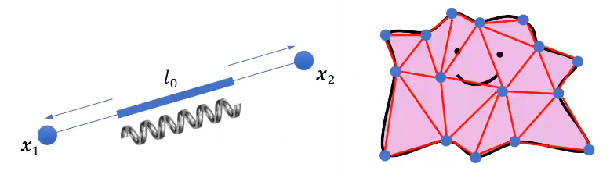
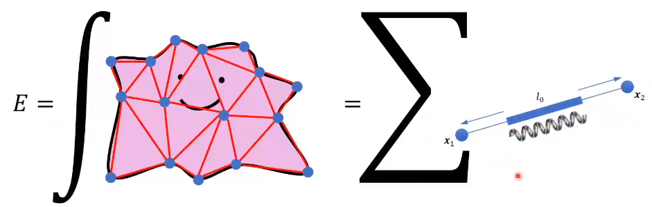
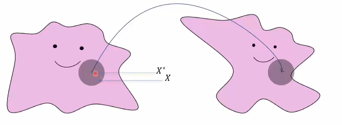
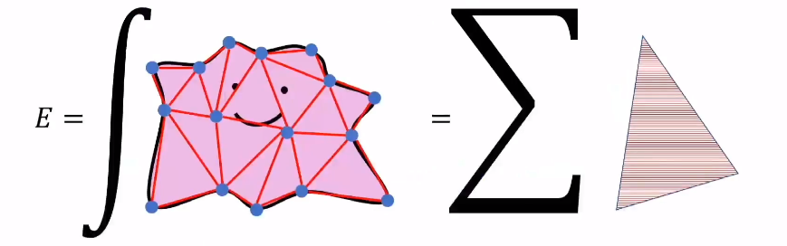
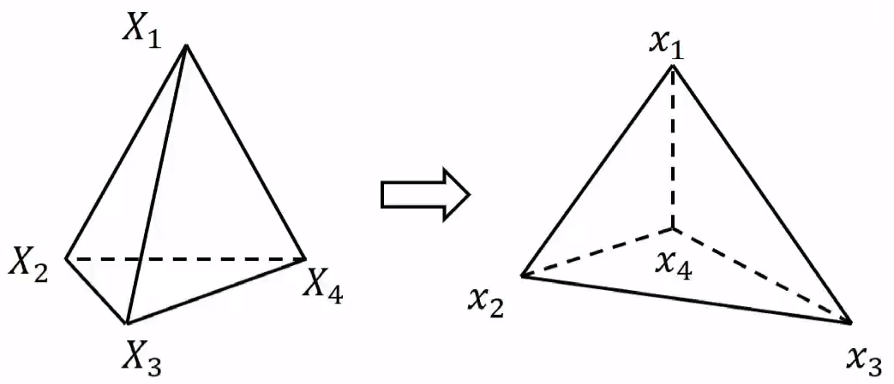

---
html:
  embed_local_images: true
  embed_svg: true
  toc: true

print_background: false
---

# Elasticity

## Time integration

### Explicit (forward) Euler integration （前向欧拉法）

$$ \begin{aligned}
&x_{n+1}=x_{n}+h v_{n} \\
&v_{n+1}=v_{n}+h M^{-1} f\left(x_{n}\right)
\end{aligned} $$

extremely fast, but will also increase the system energy...
therefore seldom used

### Symplectic Euler integration （辛欧拉法）

从辛几何推导而来，比较长期维持系统稳定，当 $h$ 越来越大会有些形变

$$ \begin{aligned}
&v_{n+1}=v_{n}+h M^{-1} f\left(x_{n}\right) \\
&x_{n+1}=x_{n}+h v_{n+1}
\end{aligned} $$

辛欧拉法才是在实际使用中称为"前向欧拉"的真正公式

### Implicit (backward) Euler integration

$$ \begin{aligned}
&v_{n+1}=v_{n}+h M^{-1} f\left(x_{n+1}\right) \\
&x_{n+1}=x_{n}+h v_{n+1}
\end{aligned} $$

随着时间积分，系统能量会慢慢减小，自带数值阻尼，时间越长

### Pipeline of time integration

- Time integration steps:
  - Evaluate $f$ at $x_n$
    - for conservative force: $f(x) = -E(x)$, where $E$ is the potential energy
  - Update $v$ using $f$ (or $M^{-1}f$
  - Update $x$ using $v$

#### Example: galaxy system

Gravitational energy:
$$E=-\frac{G M m}{r\left(x_{1}, x_{2}\right)}$$
Gradient:
$$\frac{\partial E}{\partial x_{1}}=\frac{\partial r}{\partial x_{1}} \cdot \frac{\partial E}{\partial r}=\frac{x_{1}-x_{2}}{r} * \frac{G M m}{r^{2}}$$
$$f(x_1)=-\frac{\partial E}{\partial x_{1}}$$
$$f(x_2)=-\frac{\partial E}{\partial x_{2}}=-f(x_1)$$

对于能量系统，对能量求导可以得到力，力可以得到加速度，就可以对速度进行更新，得到下一帧的位置。

The energy is all we need!!!

而弹性物体需要对连续介质进行空间的积分：

## Spatial integration

空间积分基于两种离散化方式：

- 弹簧质点系统
- 线性有限元

### Mass spring system

1. 对连续介质进行离散化
2. 将质量分布到顶点上得到质点
3. 使用弹簧连接所有的质点



弹簧的存在使得物体发生形变时会有回到原来形状的趋势

#### Define deformation

- spring current pose: $x_1, x_2$
- spring current length: $l=\left\|x_1-x_2\right\|$
- rest-length: $l_0$
- deformation: $l-l_0$

#### Hooke's Law

$$E\left(x_{1}, x_{2}\right)=\frac{1}{2} k\left(l-l_{0}\right)^{2}$$

Gradient:
$$\frac{\partial E}{\partial x_{1}}=\frac{\partial l}{\partial x_{1}} \cdot \frac{\partial E}{\partial l}=\frac{x_{1}-x_{2}}{l_{0}} * k\left(l-l_{0}\right)$$

$$f(x_1)=-\frac{\partial E}{\partial x_{1}}$$

$$f(x_2)=-f(x_1)$$



### Linear Finite Element Method (FEM)

#### Deformation map

通常情况下，形变可以被描述为变换矩阵

$$\phi(X) \approx \frac{\partial \phi}{\partial X}\left(X-X^{*}\right)+\phi\left(X^{*}\right)=\frac{\partial \phi}{\partial X} X+\left(\phi\left(X^{*}\right)-\frac{\partial \phi}{\partial X} X^{*}\right)$$
可化简为：
$$ \phi(X) \approx FX+t $$



形变梯度：

- $\phi:X\rightarrow x$
- $F=\left[\begin{array}{ll} \partial x_{1} / \partial X_{1} & \partial x_{1} / \partial X_{2} \\ \partial x_{2} / \partial X_{1} & \partial x_{2} / \partial X_{1} \end{array}\right]$
- $x \approx FX+t$

刚体形变（平动、转动）与非刚体形变（挤压变形、拉拽剪切）可以带来非零的能量

#### 能量密度 $\Psi(x)=\Psi(\phi(X))$

- $\phi(X)\approx FX+t $，因此 $\Psi(x)=\Psi(FX+t)$
- 能量对平动不敏感，如$\Psi(x)=\Psi(x+t)$，甚至对质点所在的位置 $X$都是不敏感的
- 从而 $\Psi=\Psi(F)$

Note: $\|A\|_{F}=\sqrt{\sum_{i, j} A_{i, j}^{2}}=\sqrt{\operatorname{tr}\left(A^{T} A\right)}$

#### 应变张量 Strain(tensor): $\epsilon(F)$

为了描述形变的旋转不变性和平移不变性(severity of deformation)，需要引入应变张量这一概念，$\epsilon(F)$满足如下两个条件：

- $\epsilon(I)=0$
- $\epsilon(F)=\epsilon(RF) \text{ for }  \forall R \in SO(dim) $

以连续介质力学中的一些本构模型(constitutive models)为例：

- St. Venant-Kirchhoff model: $\epsilon(F)=\frac{1}{2}(F^TF)-I$
- Co-rotated linear model: $\epsilon(F)=S-I, \text{ where }F=RS$

综上可以得到 $\Psi$：
$$\Psi(\epsilon)=\mu\|\epsilon\|_{F}{ }^{2}+\frac{\lambda}{2} \operatorname{tr}(\epsilon)^{2}$$

#### 空间积分

对空间积分需要引入 FEM ，其中 Linear Element 表示相同区块内变形是一个常数。


- 连续空间
  $$E(x)=\int_{\Omega} \Psi(F(x)) d X$$
- 离散空间
  $$E(x)=\sum_{e_{i}} \int_{\Omega_{\mathrm{e}_{i}}} \Psi\left(F_{i}(x)\right) d X=\sum_{e_{i}} w_{i} \Psi\left(F_{i}(x)\right)$$
  - $w_i=\int_{\Omega_{\mathrm{e}_{i}}}dX$: size(area/volume) of the i-th element

$$\text{能量密度} \times \text{体积} = 能量$$

对于每个线性有限元，其形变前的$X$与受力$F$形变后的$x$之间又如下关系：

$$\begin{aligned}
&x_1=FX_1+t \\
&x_2=FX_2+t \\
&x_3=FX_3+t \\
&x_4=FX_4+t
\end{aligned}$$
做差分后可得：
$$[\begin{array}{ll} x_1-x_4 & x_2-x_4 & x_3-x_4 \end{array}] = F[\begin{array}{ll} X_1-X_4 & X_2-X_4 & X_3-X_4 \end{array}]$$
即：
$$F=D_sD_m^{-1}$$

#### $\Psi(F(x))$ 的梯度

链式法则：
$$\frac{\partial \Psi}{\partial x}=\frac{\partial F}{\partial x}: \frac{\partial \Psi}{\partial F}$$

#### 总结

- Elastic energy: $E_i(x)=w_i\Psi(F_i(x))$
- Gradient: $\frac{\partial E_i}{\partial x}=w_i\frac{\partial F_i}{\partial x}:P_i$

#### Further Reading

- Finite Element Method, Part I
- Or using auto-diff in Taichi

## Implicit solution

为了在大时间步长的时候，计算仍能保证稳定

### The [Baraff and Witkin, 1998] style solution [link](https://www.cs.cmu.edu/~baraff/papers/sig98.pdf)

### Descent solution

- 梯度下降
- 牛顿迭代

### Linear Solver $Ax=b$

#### direct solver

精确求解：

- Inversion: $x = A^{-1}b$，复杂度$O(n^3)$
- Factorization: 若 A 为稀疏矩阵，稠密情形下复杂度仍为 $O(n^3)$，支持最大的稀疏矩阵大约到 1e6 (O(n), n 为三元组数量)
  $$A=\left\{\begin{array}{cl}
L U & \text {,if } A \text { is a square matrix } \\
L D L^{T} & \text {, if } A=A^{T} \\
L L^{T} & \text {, if } A=A^{T} \text { and } A>0
\end{array}\right.$$

#### iterative solver

- 基于不动点：**Jacobi** / Gauss-Seidel / SOR / Multigrid
- Krylov 子空间法：**Conjugate Gradient(CG)** / biCG / CR / MinRes / GMRes

当问题是稀疏且规模特别大时，几乎只能使用迭代法计算。

#### Factorization

- Solve $Ax=b$ is equivalent to $LL^Tx=b$
- First get L by decomposition
- Solve $Ly=b$
- Solve $L^Tx=y$

#### Conjugate Gradient

一定能保证收敛，收敛效率与 $\kappa=\frac{\lambda_{max}}{\lambda_{min}}$ 值有关（用正定矩阵最大的 Eigen value 除以最小的 Eigen value）

Works **amazingly** good if $\kappa$ is small !!!!

``` python
def conjugate_gradient(A, b, x):
  i = 0
  r = b - A @ x
  d = r
  delta_new = r.dot(r)
  delta_0 = delta_new
  while i < i_max and delta_new/delta_0 > epsilon**2:
    q = A @ d # expensive
    alpha = delta_new / d.dot(q) #expensive
    x = x + alpha * d 
    r = b - A @ x
    delta_old = delta_new
    delta_new = r.dot(r) #expensive
    beta = delta_new / delta_old
    d = r + beta * d
    i = i + 1
  return x
```

提高效率的办法：

- 把 dot product 放到 gpu 上
  - 直接把 `a.dot(b)` 写在一个 `@ti.kernel` 里，Taichi 使用 thread local storage 自动优化
- 运行 i 个迭代后，误差在 $\left\|e_{i}\right\|_{A} \leq 2\left(\frac{\sqrt{\kappa}-1}{\sqrt{\kappa}+1}\right)^{i}\left\|e_{0}\right\|_{A}$
  - 用解决 $M^{-1}Ax=M^{-1}b$ 代替 $Ax=b$ is
  - M 的取法有：
    - Jacobi: $M=diag(A)$
    - Incomplte Cholesky: $M=\widetilde{L} \widetilde{L}^{\mathrm{T}}$
    - MultiGrid

Further reading:

- An Introduction to the Conjugate Gradient Method Without the Agonizing Pain [[Link](https://www.cs.cmu.edu/~quake-papers/painless-conjugate-gradient.pdf)]
