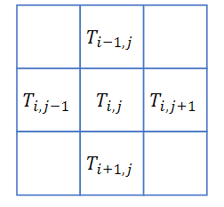

## 热传掉
### 连续域上的公式

$$\frac{\partial T}{\partial t}=\kappa \nabla^{2} T$$
- $T$: 温度，$t$：时间，$\kappa$：热传导系数 $\nabla^2$：拉普拉斯算子
- 在二维上 $\nabla^{2} T=\nabla_{x x}^{2} T+\nabla_{y y}^{2} T$

### 离散二维情形推导
#### 空间上离散化

$$\frac{\partial T_{i, j}}{\partial t}=\kappa \frac{\frac{T_{i+1, j}-T_{i, j}}{\Delta x}-\frac{T_{i, j}-T_{i-1, j}}{\Delta x}}{\Delta x}+\frac{\frac{T_{i, j+1}-T_{i, j}}{\Delta x}-\frac{T_{i, j}-T_{i, j-1}}{\Delta x}}{\Delta x}$$

$$\frac{\partial T_{i, j}}{\partial t}=\frac{\kappa}{\Delta x^{2}}\left(-4 T_{i, j}+T_{i+1, j}+T_{i-1, j}+T_{i, j+1}+T_{i, j-1}\right)$$

#### 时间上离散化
$$\frac{T_{n+1}-T_{n}}{\Delta t}=\kappa \nabla^{2} T_{n}$$


``` python
@ti.kernel
def diffuse(dt: ti.f32):
    c = dt * k / dx**2
    for i,j in t_n:
    t_np1[i,j] = t_n[i,j]
        if i-1 >= 0:
            t_np1[i, j] += c * (t_n[i-1, j] - t_n[i, j])
        if i+1 < n:
            t_np1[i, j] += c * (t_n[i+1, j] - t_n[i, j])
        if j-1 >= 0:
            t_np1[i, j] += c * (t_n[i, j-1] - t_n[i, j])
        if j+1 < n:
            t_np1[i, j] += c * (t_n[i, j+1] - t_n[i, j])

```

### 矩阵形式表示

$$\frac{T_{n+1}-T_{n}}{\Delta t}=\frac{\kappa}{\Delta x^{2}} \mathbf{D} T_{n} \rightarrow T_{n+1}=\left(\mathbf{I}+\frac{\Delta t * \kappa}{\Delta x^{2}} \mathbf{D}\right) T_{n}$$
