## Ray tracing in a nutshell
- Ref: [Ray tracing in one weekend](https://raytracing.github.io/books/RayTracingInOneWeekend.html)

### Empedocles
- Emission theory

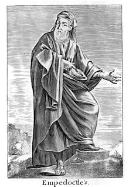
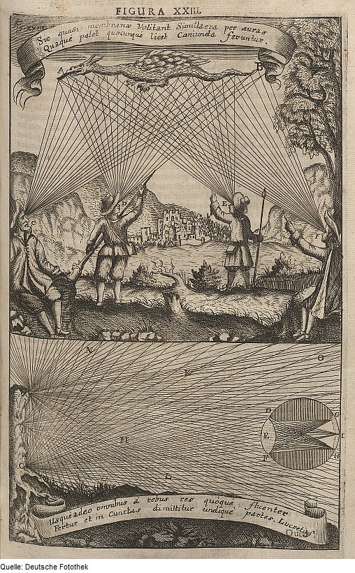

### see = color * brightness
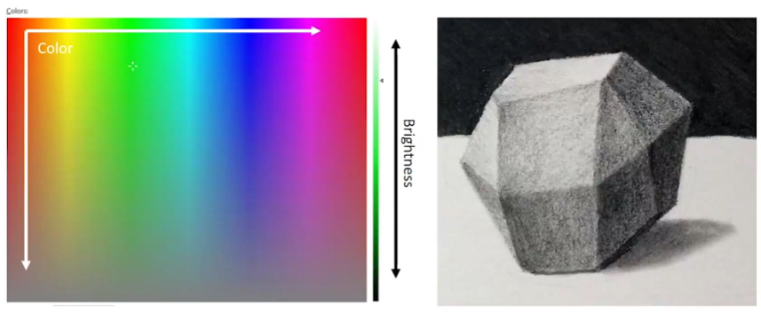

#### The Lambertian reflectance model
用能量守恒的观点看待反射

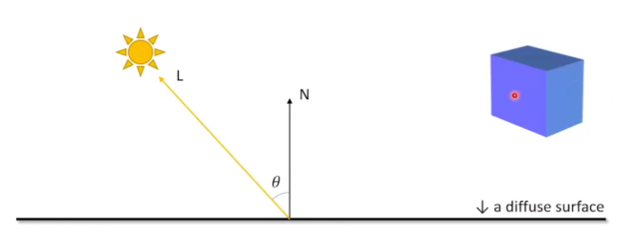
$$ \text{Brightness} = \cos(\theta) $$

#### The Phong reflectance model
反光方向与视线的夹角

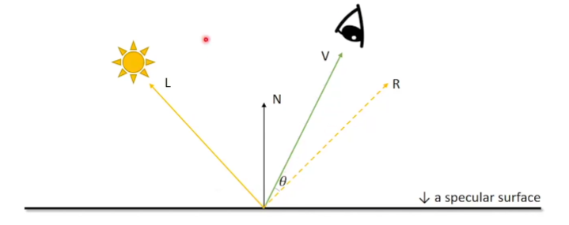

$$ \text{Brightness} = (V \cdot R)^{\alpha} = (\cos(\theta)) ^{\alpha} $$
$\alpha$ is the hardness

#### The Blinn-Phong reflectance model
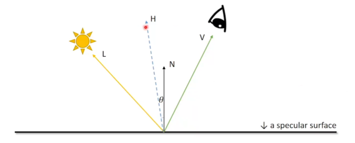
$$ \text{Brightness} = (N \cdot H)^{\alpha} = (\cos(\theta)) ^{\alpha'} , H=\frac{V+L}{||V+L||}$$
$\alpha' < \alpha$ is the hardness in Blinn-Phong

### The Whitted-style ray tracer
- An improved illumination model for shaded display [Whitted, 1979] [[Link]()]

#### Shadow
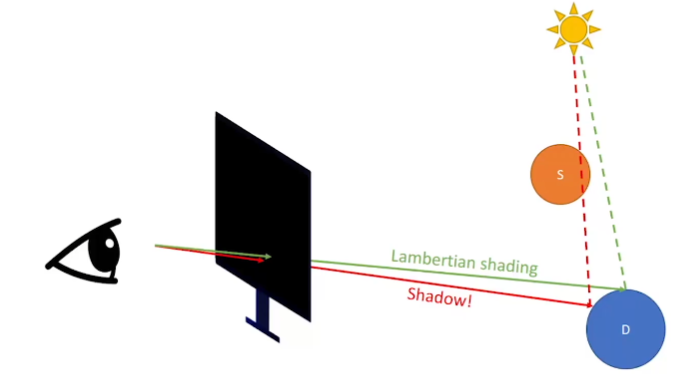
#### Reflection - Mirror
递归
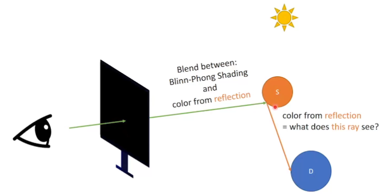
#### Refractuion - Dielectric
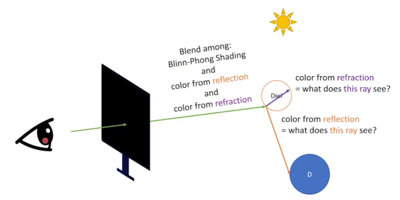

### The Path Tracer
modern ray tracer

Global illumination(GI) 全局光照，表示漫反射表面是否继续反光
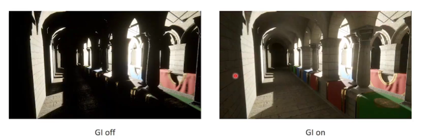
#### Diffuse surfaces

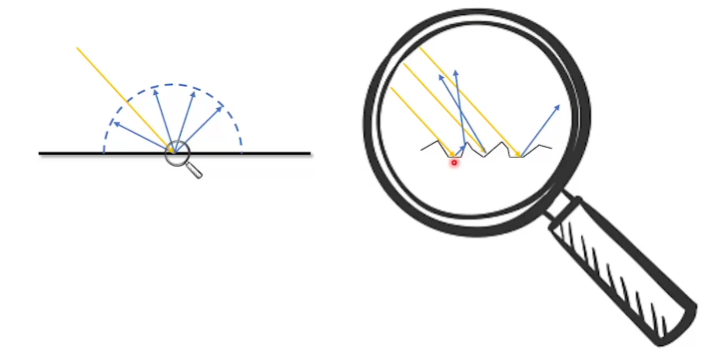
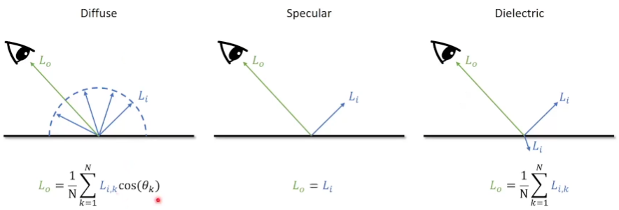

#### Monte Carlo method
随机 N 次估算物理量

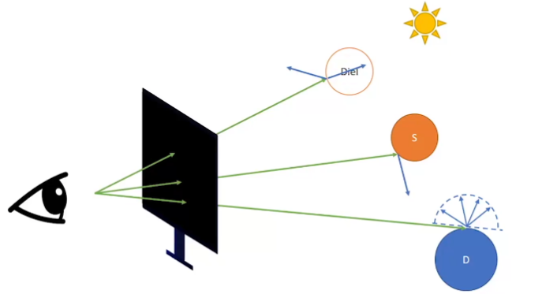

N = 1, add SPP(sample per pixel)
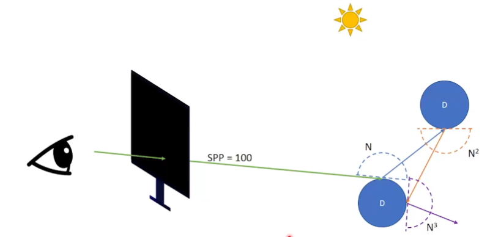
#### Russian Roulette
- stop recursion by probability$p_{RR}$(for instance 90%)
- else
  - go on recursion: what is $L_i$
  - Return $L_o/p_{RR}$

### Conclusion
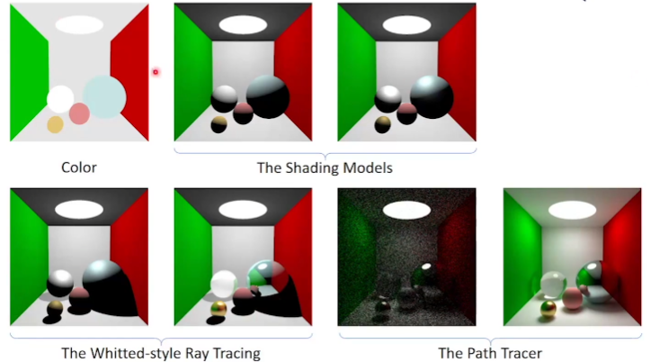

### Further readings
- The rendering equation [Kajiya 1986]

$$ L_{o}=L_{e}+\int_{\Omega} L_{i} \cdot f_{r} \cdot \cos \theta \cdot d \omega $$

- Fundamentals of Computer Graphics
- Physically Based Rendering: From Theory To Implementation
- Ray Tracing
  - In one weekend
  - The next week
  - The rest of your life
- GAMES 101
- GAMES 102
