# Fluid Simulation

SPH 光滑粒子水动力学

- 科普阅读：[从伯努利方程到NS方程](http://mathcubic.org/article/article/index/id/503/cid/3.html)
- 推导：[把NS方程简化为伯努利方程](https://zhuanlan.zhihu.com/p/94420490)

## Incompressible Navier-Stokes equation

流体可分为可压缩流体（爆炸、冲击波）和不可压缩流体（缓慢的烟尘、水）。课程关注不可压缩流体。

$$f=f_{ext}+f_{pres}+f_{visc}=ma$$

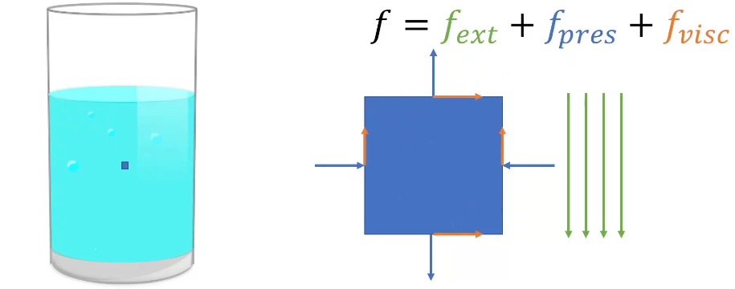

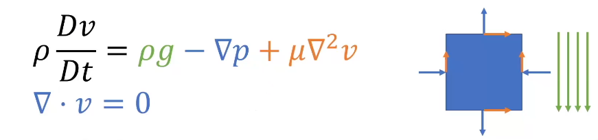

符号说明：

- 梯度：$\nabla_{S}=\left[\frac{\partial s}{\partial x}, \frac{\partial s}{\partial y}, \frac{\partial s}{\partial z}\right]^{T}$
- 散度 $\operatorname{div} v=\nabla \cdot v=\frac{\partial v_{x}}{\partial x}+\frac{\partial v_{y}}{\partial y}+\frac{\partial v_{z}}{\partial z}$
- 旋度 $\operatorname{curl} v=\nabla \times v=\left[\frac{\partial v_{z}}{\partial y}-\frac{\partial v_{y}}{\partial z}, \frac{\partial v_{z}}{\partial x}-\frac{\partial v_{x}}{\partial z}, \frac{\partial v_{y}}{\partial x}-\frac{\partial v_{x}}{\partial y}\right]^{T}$
- 拉普拉斯(laplace) $\Delta s = \nabla^{2} s=\frac{\partial^{2} s}{\partial x^{2}}+\frac{\partial^{2} s}{\partial y^{2}}+\frac{\partial^{2} s}{\partial z^{2}}$

$\rho$: 密度
$\frac{D(\cdot)}{Dt}$: 速度对时间的材料导数
$g$: 重力加速度
$p$: 压力 $p=k(\rho - \rho_0)$
$\mu$: 系数，shear modulus(dynamic vic.) $v = \frac{\mu}{\rho_0}$ 物理意义表示扩散速度

$\mu \nabla^2 v$ 是一个粘性项，表示粒子在运动时要与周围粒子尽可能保持一致，其中 $\mu$ 用于区别不同物质的粘性

$\nabla \cdot v = 0 \rightleftharpoons \frac {D\rho}{Dt}=\rho(\nabla \cdot v) = 0$ **不可压缩特性**导致流入与流出的液体总是尽可能保持一致，在一个方向上加速时另一个方向就会减速

### Time integration

两步积分（Advection-Projection）：

- Advection: input $v_n$ output $v_{n+0.5}$
  - $\rho \frac{D v}{D t}=\rho g+\mu \nabla^{2} v$
  - Solve: $dv = g + v \nabla^2v_n$
  - Update: $v_{n+0.5} = v_n+\Delta t dv$
- Projection: input $v_{n+0.5}$ output $v_{n+1}$
  - $\rho \frac{D v}{D t}=-\nabla p$
  - $\nabla \cdot v = 0$
  - Solve: $dv=-\frac{1}{\rho}\nabla(k(\rho-\rho_0))$ and $\frac{D \rho}{D t}=\nabla \cdot\left(v_{n+0.5}+d v\right)=0$
  - Update: $v_{n+1}=v_{n+0.5}+\Delta v_{n+1}$
- Update position:
  - $x_{n+1}=x_n+\Delta t v_{n+1}$
- Return x_{n+1}, v_{n+1}

### Space Discretization (Lagrangian view)

拉格朗日视角：物体的运动可以离散到带有信息的质点上
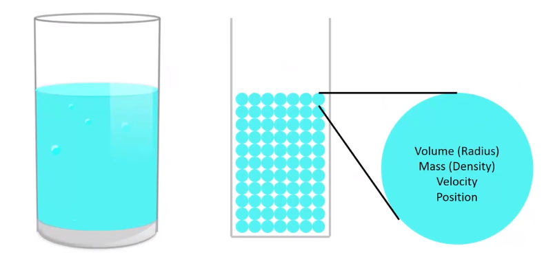

$$\frac{d v_{i}}{d t}=g-\frac{1}{\rho} \nabla p\left(x_{i}\right)+v \nabla^{2} v\left(x_{i}\right) \quad, \text { where } v=\frac{\mu}{\rho_{0}}$$

- for i in particles:
  - $v_i = v_i + \Delta t a_i$
- for i in particles:
  - $x_i = x_i + \Delta t v_i$

#### Dirac delta

$$f(r)=\int_{-\infty}^{\infty} f\left(r^{\prime}\right) \delta\left(r-r^{\prime}\right) d r^{\prime}$$

$$\delta(r)=\left\{\begin{array}{l}
+\infty, \text { if } r=0 \\
0, \text { otherwise }
\end{array} \text { and } \int_{-\infty}^{\infty} \delta(r) d r=1\right.$$

#### Widen the Dirac delta

$$f(r) \approx \int f\left(r^{\prime}\right) W\left(r-r^{\prime}, h\right) d r^{\prime}, \text { where } \lim _{h \rightarrow 0} W(r, h)=\delta(r)$$

for example:

$$W(r, h)=\left\{\begin{array}{l}
\frac{1}{2 h}, \text { if }|r|<h \\
0, \text { otherwise }
\end{array}\right.$$

#### from integration to summation

$$f(r) \approx \int f\left(r^{\prime}\right) W\left(r-r^{\prime}, h\right) d r^{\prime} \approx \sum_{j} V_{j} f\left(r_{j}\right) W\left(r-r_{j}, h\right)$$

#### A smoother kernel function

$$f(r) \approx \sum_{j} V_{j} f\left(r_{j}\right) W\left(r-r_{j}, h\right)$$

$$W(r, h)=\sigma_{d} \begin{cases}6\left(q^{3}-q^{2}\right)+1 & \text { for } 0 \leq q \leq \frac{1}{2} \\ 2(1-q)^{3} & \text { for } \frac{1}{2} \leq q \leq 1 \\ 0 & \text { otherwise }\end{cases}$$
$$\text { with } q=\frac{1}{h}\|r\|, \sigma_{1}=\frac{4}{3 h}, \sigma_{2}=\frac{40}{7 \pi h^{2}}, \sigma_{3}=\frac{8}{\pi h^{3}}$$

#### Smoothed particle hydrodynamics (SPH)

Theory and application to non-spherical stars [Gingold and Monaghan 1977]
SPH 是流体仿真中用来做空间离散化的方式，根据已知点来确定未知点的函数值
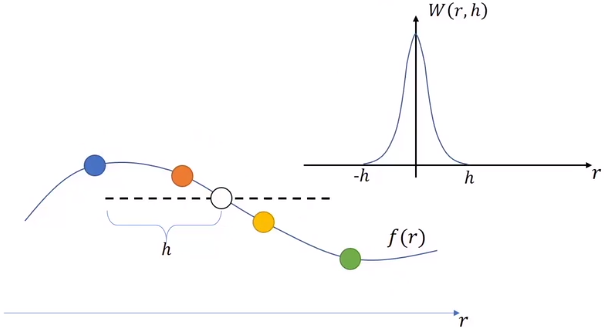

$$f(r) \approx \sum_{j} V_{j} f\left(r_{j}\right) W\left(r-r_{j}, h\right) = \sum_{j} \frac{m_j}{\rho_j}f(r_j) \nabla W(r-r_j, h)$$

#### A smooth particle in 2D

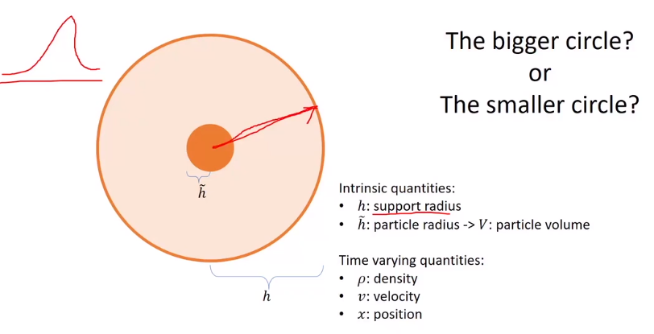

Smoothed particle 是空间中采样的一种方式，是图上的大圆

Support radius: 用于估计值

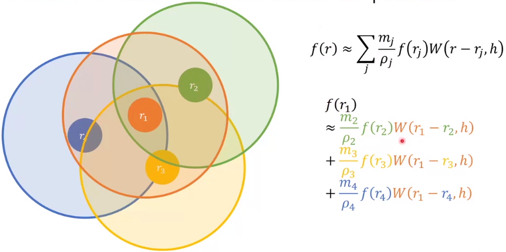

SPH discretization:
$$f(r) \approx \sum_{j} \frac{m_j}{\rho_j} f(r_{j}) W\left(r-r_{j}, h\right)$$

SPH spatial derivatives:

- $\nabla f(r) \approx \sum_{j} \frac{m_j}{\rho_j} f(r_{j})\nabla W\left(r-r_{j}, h\right)$
- $\nabla \cdot f(r) \approx \sum_{j} \frac{m_j}{\rho_j} f(r_{j})\cdot \nabla W\left(r-r_{j}, h\right)$
- $\nabla \times f(r) \approx \sum_{j} \frac{m_j}{\rho_j} f(r_{j})\times \nabla W\left(r-r_{j}, h\right)$
- $\nabla^2 f(r) \approx \sum_{j} \frac{m_j}{\rho_j} f(r_{j})\nabla^2 W\left(r-r_{j}, h\right)$

#### Improving approximation

anti-symmetric form
$$\nabla f(r) \approx \sum_{j} m_j\frac{f(r_{j}) - f(r)}{\rho_j} \nabla W\left(r-r_{j}, h\right)$$
symmetric form
$$\nabla f(r) \approx \rho \sum_{j} m_j(\frac{f(r_{j})}{\rho_j^2}+\frac{f(r)}{\rho^2}) \nabla W\left(r-r_{j}, h\right)$$

### Implementation (WCSPH)

[[实现细节](https://www.bilibili.com/video/BV1mi4y1o7wz?p=4)]

### Simulation pipeline

- for i in particles:
  - search for neighbors j
- for i in particles:
  - sample the velocity/density field using SPH
  - compute force/acceleration using Navier-Stokes equation
- for i in particles:
  - update velocity using acceleration
  - update position using velocity

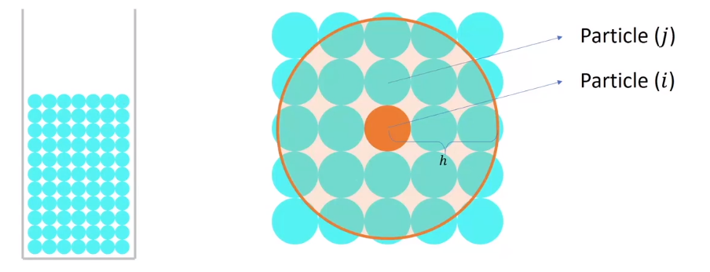

### Bondary Condition

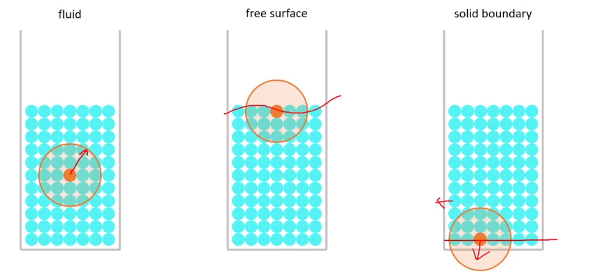
边界存在采样不足的问题

- 液体表面
  - 密度压强下降，会导致表面液体容易飞出去
  - $p=\max(0, k(\rho - \rho_0))$ 将负值去掉
- 固液表面
  - 密度压强下降
  - $p=\max(0, k(\rho - \rho_0))$
  - Solution 1: 在边界给粒子反方向的速度
  - Solution 2：加一些不存在的粒子
    - $\rho_{solid}=\rho_0$
    - $v_{solid}=0$

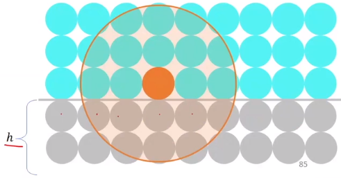

### Neighbor Search

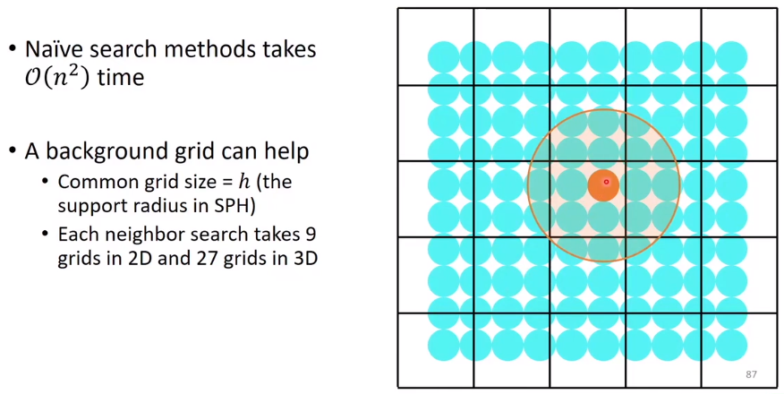

## Eulerian view

相比于拉格朗日视角，把数据存在每个小球上，欧拉视角把数据存在格点上。

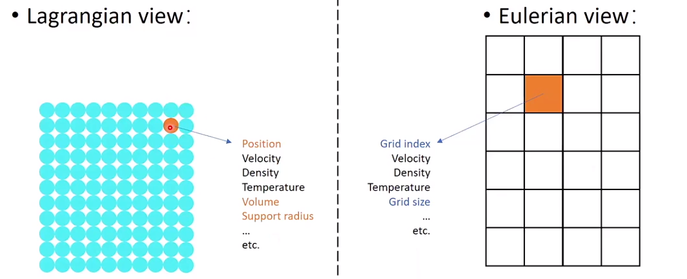

### Pros and Cons

#### Pros

- 空间离散化的误差小，精度高，总是可以仿真出精确的值，通常用于需要精确求解的汽车、飞机制造等
- 空间求导无需代价，只需插值就可以
- 固定的拓扑结构，不需要 neighbor search
- 形变问题小
- 在多种材料中不需要显式的碰撞检测

#### Cons

- Advection 比较麻烦，只能知道固定位置的粒子状态，无法知道每个粒子的位置和信息
- 边界条件不大好写（采样过少等问题）
- 与固体的耦合不是那么容易

### Spatial derivatives

每一维的导数可以单独求解：
$$\nabla q_{i, j, k}=\left[\begin{array}{l}
\partial q_{i, j, k} / \partial x \\
\partial q_{i, j, k} / \partial y \\
\partial q_{i, j, k} / \partial z
\end{array}\right]$$

用[有限差分法（FDM）](https://zh.wikipedia.org/wiki/%E6%9C%89%E9%99%90%E5%B7%AE%E5%88%86%E6%B3%95)求导

- Forward difference:
  - $(\frac{\partial q}{\partial x})_i \approx \frac{q_{i+1}-q_i}{\Delta x}$
  - Accurate to $\mathcal{O}(\Delta x)$
  - Biased

- **Central difference**
  - $(\frac{\partial q}{\partial x})_i \approx \frac{q_{i+1}-q_{i-1}}{2 \Delta x}$
  - Accurate to $\mathcal{O}(\Delta x^2)$
  - Unbiased

但是中间差分会有点问题，只看后一位和前一位在周期函数如$q_i=(-1)^i$上会导致求导变成常数等

- 改进的中间差分
  - $(\frac{\partial q}{\partial x})_i \approx \frac{q_{i+\frac{1}{2}}-q_{i-\frac{1}{2}}}{2 \Delta x}$

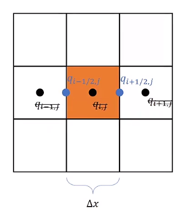

- Staggered grid

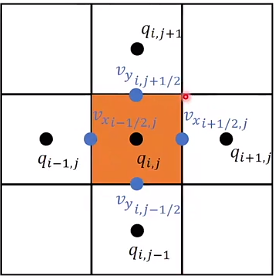

速度可以以标量的形式存在网格边缘上，如横向存 y 轴上的速度，竖向存 x 轴上的速度。边上的速度可以由四个值做差值确定，这种错位网格也被称为 MAC 网格。

Marker and Cell (MAC) Method by Harlow and Welch [1965]

- Stokes Theorem(exterior calculus)

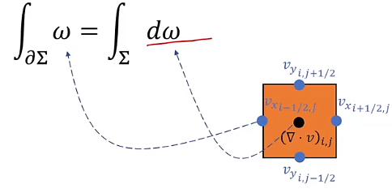

### Advection

物质导数，对时间和空间两个维度拆分求导
$$\frac{Df}{Dt}=\frac{d}{dt}f(x, t)=\frac{\partial f}{\partial t}+ v\cdot \nabla f$$
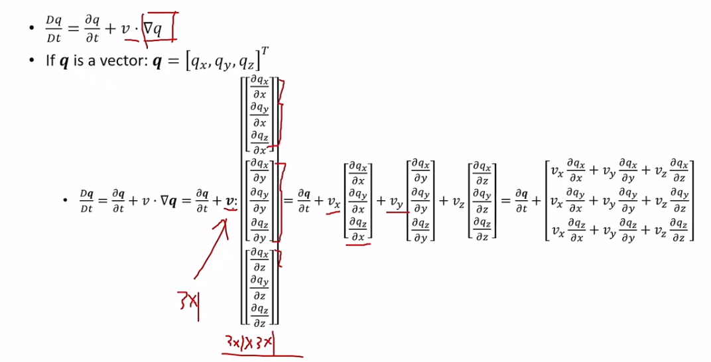

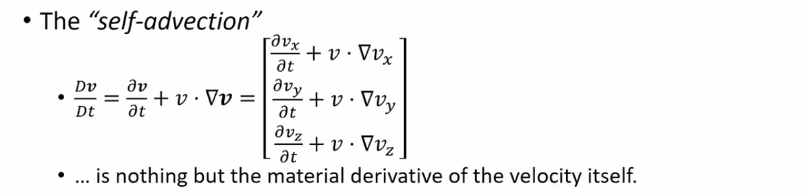

#### Finite difference

$$\frac{\partial q}{\partial t}+v \cdot \nabla q = 0$$
$$q_{i}^{n+1}=q_{i}^{n}-\Delta t v^{n} \cdot \frac{q_{i+1}^{n}-q_{i-1}^{n}}{2 \Delta x}$$
这种做法会逐渐改变曲线形状，是不负责任的做法

#### semi-Lagrangian

无条件稳定的步进方式

$$ \begin{array}{ll} q^{n+1}\left(x^{n+1}\right) &=q^{n}\left(x^{n}\right)=q^{n}\left(x^{n+1}-\Delta t v^{n}\right) \\ &=\text{interpolate}(q^n, x^{n+1}-\Delta t v^{n})\end{array}$$

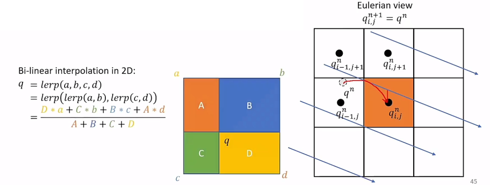

插值可以被写作：
$$q_i^{n+1}=\frac{\Delta t v^n}{\Delta x} q_{i-1}^n + (1-\frac{\Delta t v^n}{\Delta x})q_i^n$$

$$\Rightarrow q_i^{n+1}=q_i^n-\Delta t v^n \frac{q_i^n-q_{i-1}^n}{\Delta x}$$
$$\Rightarrow \frac{q_i^{n+1} - q_i^n}{\Delta t} + \Delta t v^n \frac{q_i^n-q_{i-1}^n}{\Delta x} = 0$$

事实上就是物质导数的 $\frac{\partial q}{\partial t}+v \cdot \frac{\partial q}{\partial x} = 0$ 的一种有限差分的形式，在流体力学中又叫做一阶迎风形式。

无条件稳定意味着**数值耗散**，损失量为 $\frac{v^n\Delta x}{2}\frac{\partial^2 q}{\partial x^2}$，数值粘性（或数值阻尼）

数值耗散的解决方法：

- 更精确的插值：Cubic Hermite spline interpolation [[Link](https://en.wikipedia.org/wiki/Cubic_Hermite_spline)]
- 更少误差的方法
  - MacCormack method  [[Link](https://en.wikipedia.org/wiki/MacCormack_method)]
  - Back and Force Error Compensation and Correction (BFECC) [Kim et al. 2005] [[Link](https://www.cc.gatech.edu/~jarek/papers/FlowFixer.pdf)]

### Projection

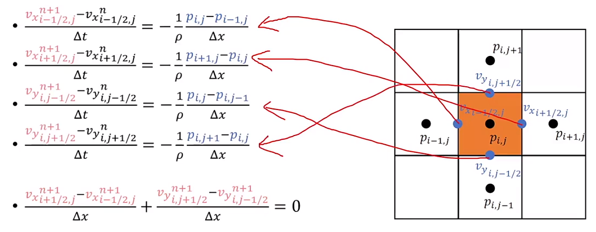

### Boundary Conditions

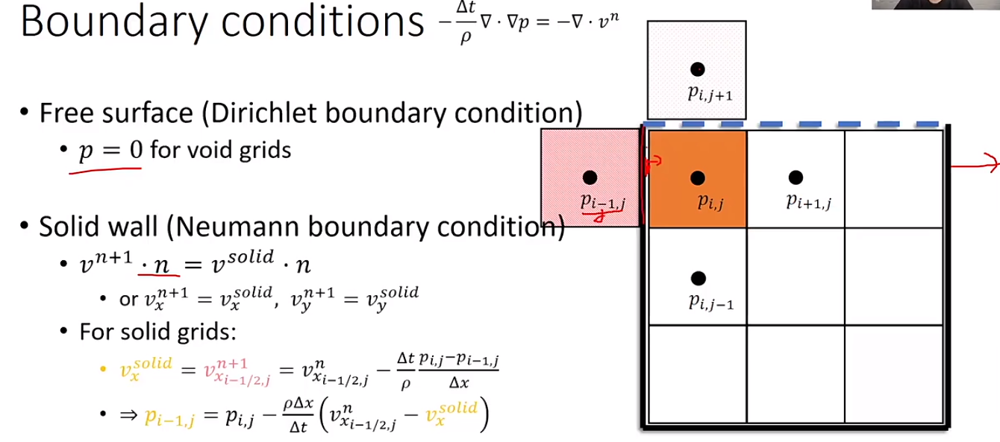

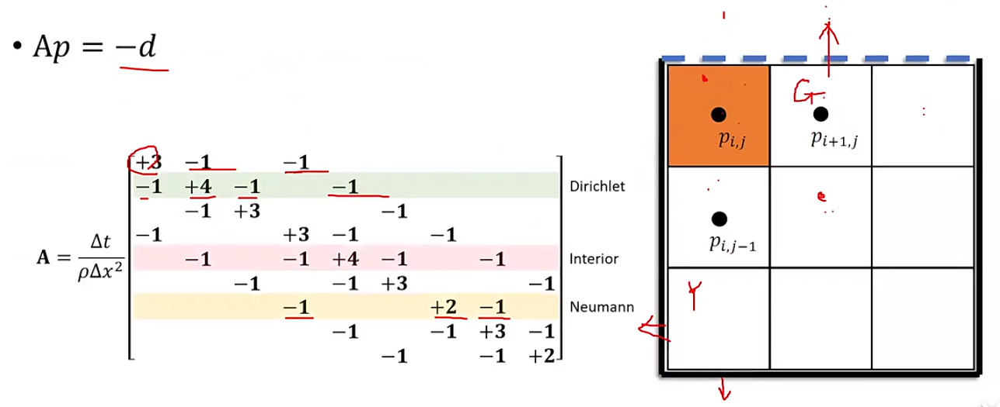

## Example

- [Eulerian Fluid](https://github.com/JerryYan97/Taichi_HW1_EulerianFluid)
- [Stable_Fluid_Zhihu](https://zhuanlan.zhihu.com/p/150466600)  `ti example stable_fluid`
